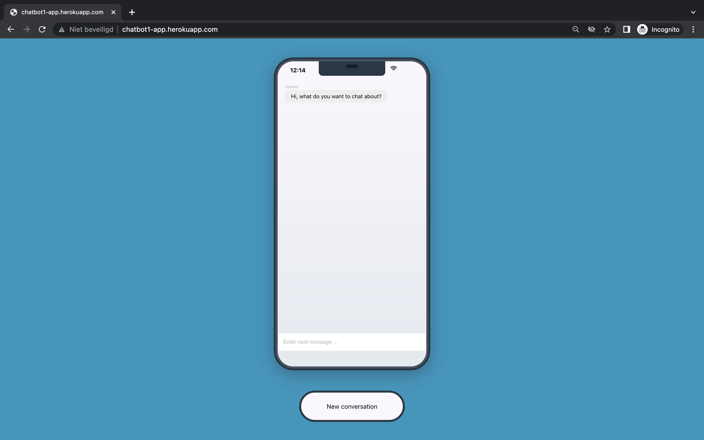

<div align="center">

\ 
Image credit: <a href="https://www.freepik.com/vectors/chatbot">Chatbot vector created by vectorjuice - www.freepik.com</a>


# Chatbot


[Overview](#scroll-overview)
•
[Screenshot](#rice_scene-screenshot)
•
[URL](#dvd-demo)
</div>

## :bookmark_tabs: Menu

- [Overview](#scroll-overview)
- [Screenshot](#rice_scene-screenshot)
- [URL](#dvd-demo)
- [Requirements](#exclamation-requirements)
- [Folder Structure](#open_file_folder-folder-structure)
- [Author](#smiley_cat-author)

## :scroll: Overview

Lorem ipsum dolor sit amet consectetur, adipisicing elit. Aut praesentium neque assumenda! Tempore culpa nihil laborum distinctio vel, illo quod veniam. Excepturi soluta beatae sed iusto sunt, impedit ducimus dignissimos?

## :rice_scene: Screenshot



## :computer: URL

http://chatbot1-app.herokuapp.com/

## :exclamation: Requirements

- [Python](https://www.python.org/)
- [Flask](https://flask.palletsprojects.com/en/2.1.x/)
- [Huggingface](https://huggingface.co/)

## :open_file_folder: Folder Structure

```
.
├── main.py              # Project source code
├── Procfile
├── requirements.txt
├── wsgi.py
├── Templates            # Folder with HTML templates
│   └── chat.html
├── Static
│   ├── CSS              # Folder with CSS
│   │   └── main.css
│   ├── JS               # Folder with JS 
│   │   └── main.js
├── Assets               # Images for the README
│   ├── logo.jpg
│   └── screenshot.png
└── README.md
```

## :smiley_cat: Author

- [@bryanlusse](https://github.com/bryanlusse)

Made with &nbsp;❤️&nbsp;