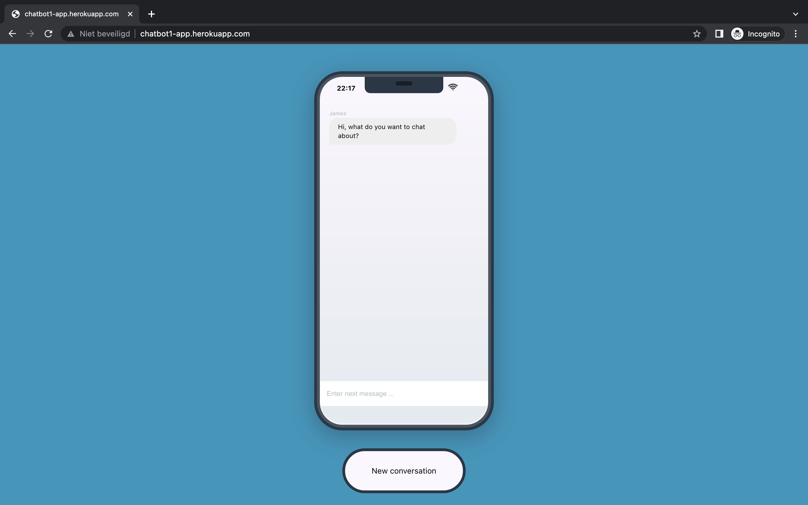

<div align="center">

)

# Title


[Overview](#scroll-overview)
•
[Screenshot](#rice_scene-screenshot)
•
[URL](#dvd-demo)
</div>

## :bookmark_tabs: Menu

- [Overview](#scroll-overview)
- [Screenshot](#rice_scene-screenshot)
- [URL](#dvd-demo)
- [Requirements](#exclamation-requirements)
- [Folder Structure](#open_file_folder-folder-structure)
- [Author](#smiley_cat-author)

## :scroll: Overview

Lorem ipsum dolor sit amet consectetur, adipisicing elit. Aut praesentium neque assumenda! Tempore culpa nihil laborum distinctio vel, illo quod veniam. Excepturi soluta beatae sed iusto sunt, impedit ducimus dignissimos?

## :rice_scene: Screenshot



## :computer: URL

http://chatbot1-app.herokuapp.com/

## :exclamation: Requirements

- [Python](https://nodejs.org/en/download/)
- [Flask](https://php.net/)
- [Huggingface](https://php.net/)

## :open_file_folder: Folder Structure

```
.
├── main.py              # Project source code
├── Procfile
├── requirements.txt
├── wsgi.py    
├── Templates            # Doc for the project
│   └── chat.html
├── Static
│   ├── CSS
│   │   └── main.css
│   ├── JS
│   │   └── main.js
├── Assets
│   ├── logo.jpg
│   └── screenshot.png
└── README.md
```

## :smiley_cat: Author

- [@bryanlusse](https://github.com/bryanlusse)

Made with &nbsp;❤️&nbsp;